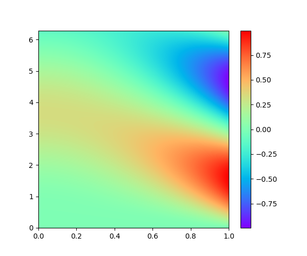

## $${\color{blue}\mathbf{Solution \space of \space 1D \space transient \space diffusion \space PDE \space using \space Neural \space Networks}}$$ ##

### $${\color{red}\mathbf{Problem \space defintion}}$$ ###

The governing PDE for 1D diffusion is given by,

$$\\frac{\\partial T}{\\partial t} = D \\frac{\\partial^2 T}{\\partial x^2} + s(x,t)$$ 

This PDE is valid for,

$$\\forall \\, x \\in (0,l) \\text{ and } 0 < t < t_{range}$$

The initial condition for this PDE is, 

$$T(x, 0) = i(x) $$

The boundary conditions for this PDE are,

$$ \\left.\\frac{\\partial T}{\\partial x}\\right\\vert_{(0,t)} = a(x, t) \\text{ and } \\left. T \\right\\vert_{(l,t)} = b(x, t)$$

where, 
$s(t)$ is the source term, 
$i(x)$ is the initial temperature distribution on the domain, 
$a(t)$ and $b(t)$ are time dependent boundary conditions terms at $x=0$ and $l$ respectively.
 

### $${\color{red}\mathbf{Numerical \space solution}}$$ ###

The numerical solution for this problem is obtained using [py-pde](https://py-pde.readthedocs.io/en/latest/) for following set of system parameters,
- $D = 0.1$
- $l = 1$
- $t_{range} = 2\pi$

The specified functions are as follows,
- $s(x, t) = 0$
- $i(x) = 0$
- $a(t) = 0$
- $b(t) = sin(t)$

  

### $${\color{red}\mathbf{\text{PINNs with unweighted loss function}}}$$ ###

With the use of the data from numerical solution one can train the a fully connected Neural Network. The training is done on $t \in [0, 0.7 * t_{range}]$ and the model performance is evaluated on the rest of the the time range $t \in [0.7 * t_{range}, t_{range}]$

The implementation can be found here in the [DatabasedNN](./DatabasedNN) subfolder.

  

  

  

